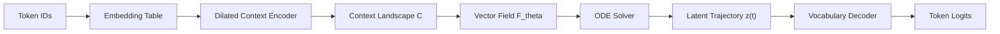
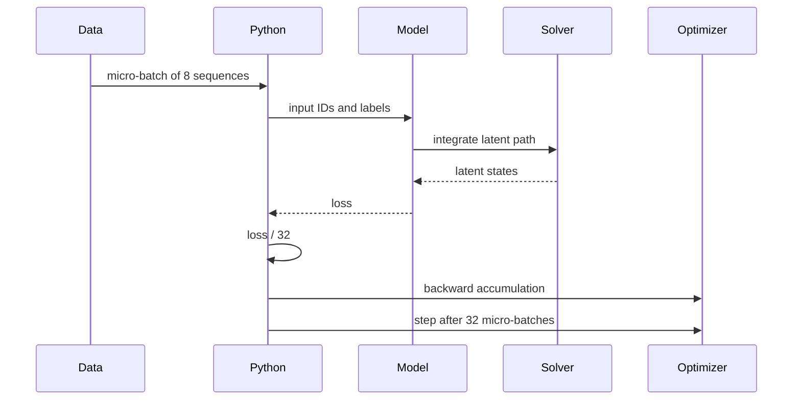
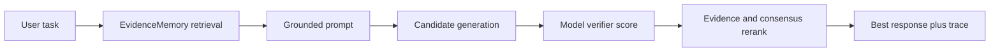

# CMF Architecture

## System Overview



CMF keeps the normal token input and output interface, but changes the internal generation mechanism from direct next-token projection to latent motion through a learned field.

## Components

### Token Embedding

Input token IDs are mapped to vectors:

```text
e_t = E[x_t]
```

The embedding matrix can be tied to the output decoder to encourage geometry alignment between continuous states and token embeddings.

### Dilated Context Encoder

The context encoder is a stack of residual temporal convolution blocks. Dilation expands the receptive field without an attention matrix:

```text
dilations = 1, 2, 4, 8, ...
```

For language modeling, the prototype uses causal convolution. For fixed prompt encoding, a non-causal variant can be used.

### Vector Field

The field receives the current latent state, the local context, and continuous solver time:

```text
v = F_theta(z, c, tau)
```

The output `v` is a direction in semantic space.

### ODE/SDE Solver

The solver advances the latent state dynamically from time $t=0$ to $t=1$. To prevent entropy sinks (fixed-point traps causing repetition) and semantic trajectory crossings, CMF uses a **Stochastic Differential Equation (SDE)** solver with high-frequency spatial jitter:

- **Langevin Diffusion**: We inject controlled thermal noise into the state integration:
  ```text
  dz = F_theta(z, c, tau) * dt + sigma_noise * Temp * dW
  ```
  where `dW` represents standard Brownian motion and `sigma_noise` (default `1e-4`) provides a spatial escape trajectory from local traps.
- **Topological Spatial Hull Jitter**: High-frequency spatial jitter acts as a spatial wedge to resolve trajectory crossings under floating-point precision constraints ($BF16/FP16$):
  ```text
  z = z + sin(z * 1000.0) * 1e-6
  ```

### Kinetic Energy Coupled Halting

Instead of relying on a separate neural halt head, CMF Couples solver halting directly to the **Kinetic Energy (L2 Norm of Velocity)** of the flowing latent state. If the semantic velocity falls below a threshold:
```text
||v(t)||_2 < epsilon (default 0.005)
```
The integration loop is aborted early, saving VRAM and computational cycles on easily processed tokens.

### Celestial Gravity Beacons (Parameter-Free Memory)

To bypass the memory-heavy multi-layer KV-Cache scaling bottleneck ($O(L^2)$), CMF deploys visited states as passive **Celestial Gravity Beacons** in coordinate space. 

- **Retrieval Mechanism**: During latent flow, the active state `z` acts as a query to retrieve historical context `c_sharp`:
  ```text
  scores = softmax(z @ C_past.T / sqrt(d_model))
  c_sharp = scores @ C_past
  ```
- **Trajectory Bending**: The retrieved context `c_sharp` dynamically bends the semantic velocity field `F_theta(z, c_effective, tau)` toward target facts without the memory footprint of attention.

### Decoder

The decoder maps trajectory points to vocabulary logits:

```text
logits = z_norm @ E.T
```

The first implementation uses tied weights by default.

## Training Loop



## Memory Strategy

Default settings:

```text
micro_batch_size = 8
gradient_accumulation_steps = 32
effective_batch_size = 256
```

This trades wall-clock overhead for lower peak memory. Moving the inner solver to C++/CUDA is intended to recover some of that overhead.

## Inference Runtime

The model can now be run through the Infinity runtime layer:



This layer lives in `cmf/infinity_runtime.py`. It is meant to make reasoning compute explicit: callers can spend more candidate-generation steps on hard tasks, attach a local knowledge file, and inspect the selected answer trace. Open-ended deliberation requires a wall-clock stop condition.

## Near-Term Engineering Milestones

1. Establish PyTorch reference correctness.
2. Benchmark Python solver overhead.
3. Build and test C++/CUDA Euler integration.
4. Add custom backward or composite autograd support for the fast path.
5. Fuse vector-field evaluation with integration.
6. Add native parity for adaptive step selection and deliberation telemetry.
7. Compare against Transformer, Mamba, and TCN baselines.
